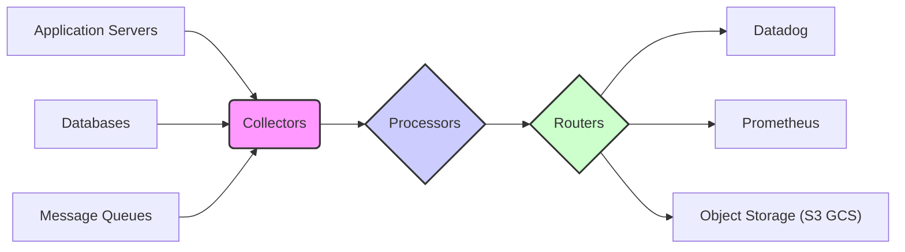

Observability pipelines are the unsung heroes of modern distributed systems. They're the data refineries, taking raw telemetry data – metrics, logs, and traces – and transforming it into valuable insights. This isn't simply about collecting data; it's about shaping it, enriching it, and routing it efficiently to the right destinations, all while controlling costs and ensuring performance. Think of them as the circulatory system of your application's observability, ensuring vital information reaches the brain (your monitoring tools) in a timely and digestible manner.

### The Problem: Raw Telemetry Data is a Deluge

Imagine trying to diagnose a performance bottleneck by sifting through terabytes of raw logs, unaggregated metrics, and unsampled traces. It's akin to searching for a single faulty wire in a city's entire electrical grid without a blueprint.  The volume, velocity, and variety of modern telemetry data demand a more sophisticated approach than simply dumping everything into a central repository.

**Typical Challenges:**

*   **High Ingestion Costs:**  Sending every log line and metric point to your observability platform (e.g., Datadog, New Relic, Prometheus) can quickly become prohibitively expensive, especially at scale.
*   **Performance Overheads:**  Generating, transmitting, and storing massive amounts of telemetry data can strain application resources and network bandwidth.
*   **Lack of Context:** Raw data often lacks the context needed for effective troubleshooting. A simple error message without correlation to other events is often useless.
*   **Security & Compliance:** Sensitive data (e.g., PII) within logs and traces must be scrubbed or masked before being sent to external systems.
*   **Vendor Lock-in:**  Becoming overly reliant on a specific observability platform can limit flexibility and increase costs in the long run.

### The Solution: The Observability Pipeline

An observability pipeline is a dedicated infrastructure layer responsible for collecting, processing, and routing telemetry data. It typically consists of the following key components:

*   **Collectors:** Agents or daemons that gather data from various sources (application servers, databases, message queues, etc.).
*   **Processors:** Modules that transform, enrich, filter, and aggregate data.
*   **Routers:** Components that direct data to different destinations based on predefined rules.
*   **Exporters:** Connectors that send processed data to observability platforms, storage systems, and other endpoints.

**Visual Representation:**



**Key Benefits:**

*   **Cost Optimization:**  By filtering and aggregating data, pipelines significantly reduce the volume of data sent to observability platforms, leading to lower ingestion costs.
*   **Improved Performance:**  Offloading processing tasks from application servers to the pipeline frees up resources and reduces latency.
*   **Enhanced Insights:** Enriching data with contextual information (e.g., adding metadata, correlating events) makes it easier to identify and resolve issues.
*   **Security & Compliance:** Pipelines can be used to redact sensitive data, ensuring compliance with privacy regulations.
*   **Flexibility & Scalability:**  Pipelines can be easily adapted to changing requirements and scaled to handle increasing data volumes.
*   **Vendor Neutrality:** By decoupling data collection and processing from specific observability platforms, pipelines provide greater flexibility and reduce vendor lock-in.

### Deep Dive: Core Pipeline Components and Techniques

Let's explore some of the essential techniques used within observability pipelines:

**1. Collection Strategies:**

*   **Agent-based Collection:**  Deploying lightweight agents (e.g., Fluentd, Telegraf, OpenTelemetry Collector) on application servers to collect logs, metrics, and traces.  This is the most common approach.
*   **Sidecar Pattern:**  Running collectors as sidecar containers alongside application containers in a Kubernetes environment. This provides isolation and simplifies deployment.
*   **Direct Ingestion:**  Applications can directly send telemetry data to the pipeline (e.g., using HTTP or gRPC). This is suitable for simple scenarios but can increase application complexity.
*   **Pull-based Collection (for Metrics):**  Collectors periodically scrape metrics endpoints (e.g., Prometheus exporters).  This is well-suited for infrastructure metrics.

**2. Processing Techniques:**

*   **Filtering:**  Discarding irrelevant or noisy data.  For example, dropping debug-level logs in production environments.  Configuration example (using a hypothetical pipeline language):

    ```yaml
    processors:
      drop_debug_logs:
        type: filter
        where: 'severity == "debug"'
    ```

*   **Aggregation:**  Summarizing data over time to reduce volume and highlight trends.  For example, calculating average request latency over 5-minute intervals.  Crucial for metrics.
*   **Transformation:**  Modifying data to improve its format or content.  For example, renaming fields, converting data types, or extracting information from unstructured log messages.

    ```yaml
    processors:
      extract_request_id:
        type: transform
        pattern: 'request_id=(?P<request_id>\w+)'
        source_field: 'log_message'
        target_field: 'request.id'
    ```

*   **Enrichment:**  Adding contextual information to data.  For example, adding geographic location based on IP address, or enriching logs with metadata from Kubernetes.  This is *vital* for effective troubleshooting.
*   **Sampling:**  Reducing the volume of trace data by only collecting a subset of spans.  Adaptive sampling adjusts the sampling rate based on traffic volume and error rates.

    ```yaml
    processors:
      tail_sampling:
        type: tail_sampling
        decision_wait: 10s
        num_traces: 1000
        expected_new_traces_per_sec: 100
    ```

*   **Redaction/Masking:**  Removing or masking sensitive data (e.g., PII) to comply with privacy regulations.  Regular expressions and predefined dictionaries are commonly used for this purpose.

**3. Routing Strategies:**

*   **Content-Based Routing:**  Directing data to different destinations based on its content (e.g., sending error logs to one system and performance metrics to another).
*   **Priority-Based Routing:**  Prioritizing the delivery of critical data (e.g., error logs) over less important data (e.g., debug logs).  This can be achieved through queuing mechanisms.
*   **Fan-out Routing:**  Sending the same data to multiple destinations (e.g., sending logs to both a log aggregation system and a security information and event management (SIEM) system).

**4. Common Pipeline Technologies:**

*   **Fluentd/Fluent Bit:**  Open-source data collectors and processors written in Ruby and C, respectively.  Widely used for log aggregation.
*   **Logstash:**  Open-source data processing pipeline from Elastic.  Powerful but can be resource-intensive.
*   **OpenTelemetry Collector:**  A vendor-neutral, open-source agent for collecting telemetry data.  Becoming the standard for observability.  Supports traces, metrics, and logs.
*   **Vector:**  A high-performance data router written in Rust.  Designed for observability pipelines.
*   **Apache Kafka/Pulsar:**  Distributed streaming platforms that can be used as the backbone of an observability pipeline.  Provide scalability and reliability.
*   **Cloud-Specific Solutions:** AWS Kinesis Data Streams, Google Cloud Pub/Sub, Azure Event Hubs.

### Example: Building a Simple Observability Pipeline with OpenTelemetry Collector

Let's illustrate how to build a basic observability pipeline using the OpenTelemetry Collector.  We'll configure it to receive logs via the `otlp` (OpenTelemetry Protocol) receiver, process them by adding a resource attribute (e.g., hostname), and export them to the console.

**Configuration (`config.yaml`):**

```yaml
receivers:
  otlp:
    protocols:
      grpc:
        endpoint: "0.0.0.0:4317"
      http:
        endpoint: "0.0.0.0:4318"

processors:
  batch:
  resource:
    attributes:
      service.name: "my-application"
      host.name: "${env:HOSTNAME}"

exporters:
  logging:
    loglevel: debug

service:
  pipelines:
    logs:
      receivers: [otlp]
      processors: [resource, batch]
      exporters: [logging]
```

**Explanation:**

*   **Receivers:** Defines how the collector receives data. Here, we're using the `otlp` receiver to accept data over gRPC and HTTP on ports 4317 and 4318, respectively.  This is the standard OpenTelemetry protocol.
*   **Processors:**  Specifies the transformations to apply to the data.  `resource` processor adds attributes to the log records.  `batch` processor groups logs into batches for efficient export.
*   **Exporters:**  Defines where the processed data is sent.  Here, we're using the `logging` exporter to print the logs to the console (for debugging purposes).
*   **Service:**  Connects the receivers, processors, and exporters into a pipeline.  The `logs` pipeline defines the flow of log data.

**Running the Collector:**

```bash
otelcol --config=config.yaml
```

To send logs to this collector, you would configure your application to use the OpenTelemetry SDK and export logs to the collector's `otlp` endpoint.  Numerous examples exist in all common languages.

**Scaling up:**  In a real-world scenario, you'd replace the `logging` exporter with a proper exporter (e.g., Datadog, Prometheus, Splunk) and deploy the collector in a highly available configuration (e.g., using Kubernetes).

### Advanced Considerations

*   **Backpressure Handling:**  Pipelines need to handle situations where the ingestion rate exceeds the processing or export capacity.  Queuing, rate limiting, and circuit breaking are common techniques for backpressure management.
*   **Pipeline Monitoring:**  Monitoring the health and performance of the pipeline itself is crucial.  Metrics such as ingestion rate, processing latency, and error rate should be tracked.  OpenTelemetry can be used to monitor the OpenTelemetry Collector itself.
*   **Configuration Management:**  Managing pipeline configurations can be complex, especially in large-scale deployments.  Infrastructure-as-Code (IaC) tools like Terraform or Ansible can be used to automate the configuration process.
*   **Security:**  Securing the pipeline is essential to protect sensitive data.  TLS encryption, authentication, and authorization should be enabled.
*   **Idempotency:** Processors should ideally be idempotent, meaning that processing the same event multiple times has the same effect as processing it once.  This helps prevent data inconsistencies in case of failures.

### Observability Pipelines: A Strategic Investment

Building and maintaining an observability pipeline requires a significant investment, but the benefits far outweigh the costs. By centralizing data processing, enriching telemetry, and routing data intelligently, pipelines enable organizations to gain deeper insights into their systems, improve performance, and reduce operational costs. They are not simply a tool; they are a strategic asset that enables data-driven decision-making and facilitates a more proactive and resilient approach to operations. Embracing observability pipelines is no longer optional; it's a prerequisite for success in today's complex and dynamic software landscape. They bridge the gap between raw data and actionable intelligence, turning the deluge of telemetry into a clear signal.
